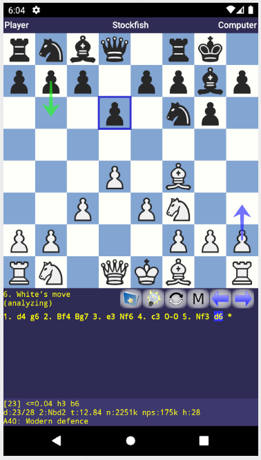

# ChessCheater

> ChessCheater is an app designed to punish people who cheat in chess.

I keep hearing that it is super common in online chess for people to use the computer to find the best move.

This app hs the semi-ethical goal of punishing people who cheat at chess online. It will usually tell people to play an okay-ish move. Not the best one possible, but one of the top 5. But then sometimes it will tell people to make insidiously bad moves. It will do this particularly if the move might *look* good to someone that's not paying attention.

The tricky part will be how to disseminate information about this app to the honest chess community. That way, when a cheater asks for tools on forums, honest players can direct them here. The social engineering will definitely be the hardest part of the design.

## DroidFish Rocks

This app is basically just me mangling the pre-existing [DroidFish](https://github.com/peterosterlund2/droidfish) repo.
Peter Osterlund is really to credit for making an Android wrap of the C++ StockFish engine available to the public.
