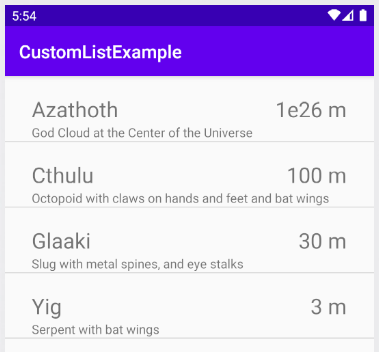

# CustomListExample

This app was created following [Bill Butterfield's](https://www.youtube.com/channel/UCTfCl-a8_6aKT_Mdd4HkaUw) excellent tutorial [here](https://www.youtube.com/watch?v=rdGpT1pIJlw).

## Goals

The goals of this little test app are to learn about

* custom layouts
* image displays

## The Stack

Here's the stack I am using for this repo:

    Ubuntu 18.04 (64-bit)
    Android Studio 4.0.1
    Java v11.0.8
    Gradle v6.1.1
